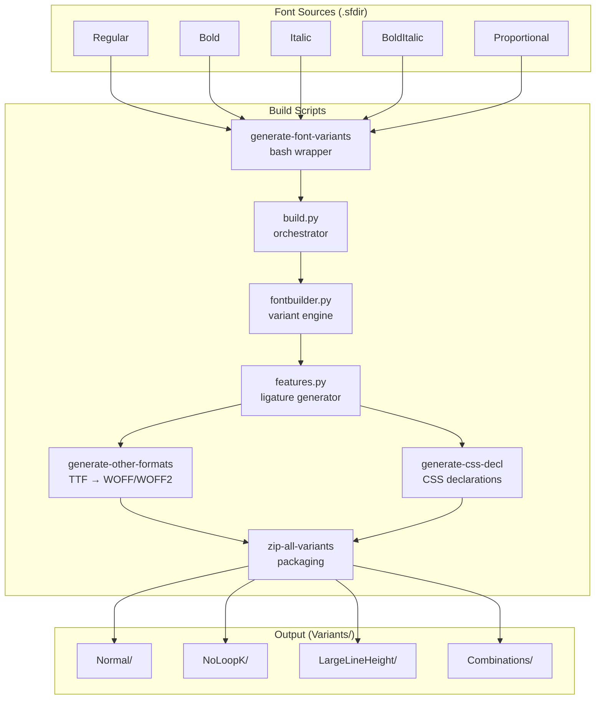
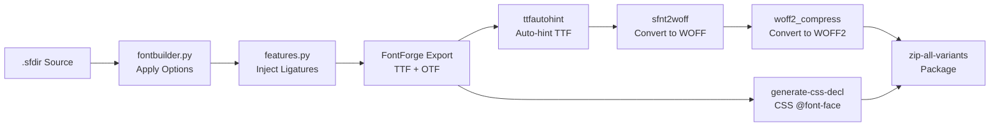

# Architecture Documentation
<!-- markdownlint-disable -->


This document serves as the canonical architectural map of the repository. It outlines the design patterns, technical stack, directory structure, and module constraints to assist developers and AI agents in navigating and maintaining the codebase safely.

## 1. Project Overview

**Fantasque Sans Mono** is a programming font (monospace) designed with functionality in mind, featuring a distinctive wibbly-wobbly handwriting-like fuzziness that makes it unassumingly cool. It was previously known as *Cosmic Sans Neue Mono*.

- **Primary Goal:** Provide a high-quality, handcrafted monospace font optimized for programming environments
- **Intended Audience:** Software developers, terminal users, and anyone seeking a unique yet readable coding font
- **Author:** Jany Belluz
- **License:** SIL Open Font License (OFL) — subsetting, compression, and modification are explicitly permitted without renaming
- **Current Version:** v1.8.0 (2019-11-16)

### Key Features

- **4 weights:** Regular, Bold, Italic, Bold Italic — all with identical metrics
- **Coding ligatures:** Contextual alternates (`calt`) for common programming sequences (e.g., `->`, `=>`, `!=`, `==`, `//`, `/**`, `||`)
- **Stylistic set `ss01`:** No-loop `k` variant for a cleaner look
- **Large line height variant:** Accommodates accented capital letters
- **Glyph coverage:** Latin (extensive), Cyrillic, Greek, box drawing, Powerline symbols, block characters
- **Output formats:** TTF, OTF, WOFF, WOFF2, SVG, with auto-generated CSS `@font-face` declarations

## 2. High-Level Architecture & Tech Stack

| Layer | Technology |
|---|---|
| **Primary Language (Build)** | Python 2.7 + Bash (shell scripting) |
| **Font Authoring** | FontForge (`.sfdir` — Spline Font Directory format) |
| **Build Orchestration** | GNU Make |
| **Font Hinting** | `ttfautohint` (Freetype auto-hinter) |
| **Web Font Conversion** | `sfnt2woff` (WOFF), `woff2_compress` (WOFF2 from Google) |
| **Containerization** | Docker (Ubuntu 18.04 base image) |
| **OS Packaging** | `fpm` (DEB/RPM) |
| **Architectural Pattern** | Pipeline-based Build → Permutation Engine → Multi-format Output |

### Architecture Diagram



## 3. Data Flow & Layer Dependencies

The build pipeline follows a strict linear flow with a variant explosion step:

1. **Source Layer** — FontForge `.sfdir` directories containing per-glyph spline data
2. **Variant Expansion Layer** — `fontbuilder.py` reads the font and applies option permutations (binary bitmap)
3. **Feature Generation Layer** — `features.py` scans for `.liga` glyphs and auto-generates OpenType `calt` substitution rules
4. **Format Conversion Layer** — FontForge exports TTF/OTF, then shell scripts convert to WOFF/WOFF2/SVG
5. **Packaging Layer** — CSS declarations generated, all files zipped per variant



### Variant Permutation Logic

The build system generates all possible variants using a binary bitmap approach (2^n combinations):

```python
# Each option acts as an independent binary toggle:
# Bit 0: LargeLineHeight (on/off)
# Bit 1: NoLoopK (on/off)

# Operations are applied in sequence:
# 1. Line(ascent, descent)      → Adjust line height metrics
# 2. SwapLookup('ss01')          → Swap looped k with straight k
# 3. Variation(name)             → Rename font family
```

## 4. Dependencies & External Services

| Dependency | Purpose | Required |
|---|---|---|
| **FontForge** (≥ 2017) | Font creation, editing, and TTF/OTF export via Python API | Yes — core build |
| **ttfautohint** | Automatic TrueType hinting for Windows rendering quality | Yes |
| **sfnt2woff** (woff-tools) | Convert TTF to WOFF format for web use | Yes |
| **woff2_compress** (Google WOFF2) | Convert TTF to WOFF2 format (superior web compression) | Yes |
| **Docker** (≥ 18.x) | Containerized build environment (Ubuntu 18.04 + all deps) | Optional |
| **fpm** (Effing Package Management) | Build `.deb` and `.rpm` OS packages | Optional |
| **Python 2.7** | Required by FontForge's Python scripting interface | Yes — build |

> **Important:** Ubuntu's default FontForge package is often outdated. The Dockerfile and README both recommend the [FontForge PPA](https://launchpad.net/~fontforge/+archive/ubuntu/fontforge) for reliable builds.

## 5. Directory Tree Map

```text
fantasque-sans/
├── .agents/                          # AI Agent SDLC pipeline infrastructure
│   ├── instructions/                 # Global agent instructions
│   │   ├── clean-code-clean-architecture.instructions.md
│   │   ├── markdown.instructions.md
│   │   └── memory.instructions.md    # Cross-session context persistence
│   ├── rules/                        # Agent persona definitions (9 agents)
│   │   ├── ArtifactConsistencyChecker.md
│   │   ├── BrainstormingExplorerAnalyst.md
│   │   ├── BugRemediationArchitect.md
│   │   ├── ClarificationAnalyst.md
│   │   ├── DiataxisDocumentationArchitect.md
│   │   ├── ExpertCodeReviewer.md
│   │   ├── GodModeDev.md
│   │   ├── PlannerArchitect.md
│   │   ├── ProductManagerPRD.md
│   │   └── SpecificationArchitect.md
│   ├── skills/                       # Agent skill workflows (10+ skills)
│   │   ├── artifact-consistency-checker/
│   │   ├── brainstorming-explorer/
│   │   ├── bug-remediation-architect/
│   │   ├── clarification-analyst/
│   │   ├── diataxis-documentation-architect/
│   │   ├── expert-code-reviewer/
│   │   │   └── references/           # Review rubrics & security guides
│   │   ├── fable-protocol/
│   │   ├── god-mode-dev/
│   │   │   └── references/           # Execution workflow & communication protocol
│   │   ├── grilling/
│   │   ├── karpathy-guidelines/
│   │   ├── memory-manager/
│   │   ├── omni-dev/
│   │   ├── planner-architect/
│   │   ├── ponytail-lazy-senior-dev/
│   │   ├── product-manager-prd/
│   │   ├── project-researcher/
│   │   │   └── references/           # ARCHITECTURE-TEMPLATE.md
│   │   ├── specification-architect/
│   │   └── ui-designer/
│   └── standards/                    # Documentation standards
│       ├── ADR-FORMAT.md             # Architecture Decision Record template
│       └── CONTEXT-FORMAT.md         # Domain glossary template
├── docs/                             # Project documentation
│   └── ARCHITECTURE.md               # This file
├── Scripts/                          # Build pipeline (executable scripts)
│   ├── build.py                      # Main build orchestrator
│   ├── fontbuilder.py               # Font variant generation engine
│   ├── features.py                   # OpenType ligature feature generator
│   ├── generate-font-variants        # Bash wrapper for build.py
│   ├── generate-other-formats        # TTF → WOFF/WOFF2 converter
│   ├── generate-css-decl             # CSS @font-face declaration generator
│   ├── validate-font                 # Font validation checker
│   └── zip-all-variants              # Final packaging script
├── Sources/                          # Font source files (FontForge format)
│   ├── FantasqueSans.sfdir/          # Proportional variant (~300+ glyph files)
│   ├── FantasqueSansMono-Regular.sfdir/ # Monospace Regular (~600+ glyph files)
│   ├── FantasqueSansMono-Bold.sfdir/ # Monospace Bold
│   ├── FantasqueSansMono-Italic.sfdir/ # Monospace Italic
│   └── FantasqueSansMono-BoldItalic.sfdir/ # Monospace Bold Italic
├── Specimen/                         # Screenshots and specimen PDF
│   ├── Specimen.pdf
│   ├── Specimen.png
│   ├── kdevelop11.png
│   ├── sublime11.png
│   ├── urxvt13.png
│   ├── vim21.png
│   ├── noloopk.png
│   └── RFC page ru.pdf
├── Variants/                         # Build output (generated, gitignored)
│   ├── Normal/                       # Default variant
│   ├── NoLoopK/                      # No-loop k variant
│   ├── LargeLineHeight/              # Large line height variant
│   └── NoLoopK-LargeLineHeight/      # Combined variant
├── AGENTS.md                         # Master agent rules & SDLC workflow definition
├── CHANGELOG.md                       # Release history (v1.1 → v1.8.0)
├── Dockerfile                        # Ubuntu 18.04 build environment
├── LICENSE.txt                       # SIL Open Font License
├── Makefile                          # Top-level build entry point
├── README.md                         # Project landing page & user guide
├── _config.yml                       # GitHub Pages configuration
├── fontdiff                          # Font comparison HTML generator
├── pkg.sh                            # OS package builder (fpm)
└── .gitignore                        # Ignores: TeX, Variants/, *.pyc, *.zip
```

## 6. Directory Purposes & Responsibilities

| Directory / File | Primary Purpose | Contains | Rules / Constraints |
|---|---|---|---|
| `Sources/` | Font source of truth | 5 `.sfdir` directories, each holding per-glyph `.glyph` files (~600+ glyphs per mono variant) | Must be opened with FontForge; `.glyph` files contain spline data in FontForge's native format |
| `Scripts/` | Build pipeline | 3 Python modules + 5 bash scripts | Python scripts require FontForge's Python API (`import fontforge`); bash scripts orchestrate Python |
| `Scripts/build.py` | Build orchestration | Entry point for `generate-font-variants`; defines available font options | Receives 4 CLI args: parallel count, batch number, `.sfdir` path, output dir |
| `Scripts/fontbuilder.py` | Variant engine | `Line`, `Bearing`, `Swap`, `SwapLookup`, `Variation`, `DropCAltAndLiga` operations + binary bitmap permutation logic | Adapted from [Monoid](https://github.com/larsenwork/monoid); uses Python 2.7 `xrange` |
| `Scripts/features.py` | Ligature generator | Auto-generates OpenType `calt` feature from `.liga` glyphs; handles ignore rules and prefix exceptions | Adapted from [FiraCode](https://github.com/tonsky/FiraCode) `gen_calt.clj`; must write to tempfile for `mergeFeature()` |
| `Specimen/` | Visual samples | Screenshots (PNG), printable specimen (PDF), rendered samples in different editors | Used in README.md for visual reference |
| `Variants/` | Build output | Generated TTF, OTF, WOFF, WOFF2, SVG files per variant | Gitignored; recreated by `make`; consumed by `pkg.sh` for OS packaging |
| `.agents/` | AI agent infrastructure | Agent personas, skill workflows, instructions, documentation standards | Read by AI coding agents at session start; defines entire SDLC pipeline |
| `.agents/rules/` | Agent personas | 9 markdown files defining agent identities, scope boundaries, pushback rules | Each agent has a strict phase boundary; cross-phase work must be refused |
| `.agents/skills/` | Agent capabilities | 10+ SKILL.md files with step-by-step workflows | Skill = Procedure, Agent = Persona; skills may or may not trigger session lock |
| `.agents/instructions/` | Global AI rules | Clean code guidelines, markdown formatting rules, memory persistence | Checked at session start; priority order defined in AGENTS.md |
| `.agents/standards/` | Documentation templates | ADR format and CONTEXT (domain glossary) format | All documentation must follow these formats |
| `docs/` | Project docs | ARCHITECTURE.md, future: ADRs, context maps | Created lazily as needed per SDLC standards |
| `AGENTS.md` | Master rulebook | Universal AI agent rules, SDLC workflow, communication policy, custom agent usage | Highest-priority instruction file; overrides all other rules except direct user command |
| `Makefile` | Build entry | Discovers `Sources/*.sfdir`, triggers `generate-font-variants` per source, then `zip-all-variants` | Target: `all` → `Variants/Normal/FantasqueSansMono.zip` |
| `Dockerfile` | Containerized build | Ubuntu 18.04 + FontForge PPA + all build deps | `docker build` then `docker run -v $(pwd)/Variants:/fantasque/Variants` |
| `fontdiff` | Visual comparison | Generates `fontdiff.html` — side-by-side glyph comparison of two TTF fonts with red/blue overlay | Uses FontForge to enumerate glyphs; embeds fonts as base64 data URIs |
| `pkg.sh` | OS packaging | Uses `fpm` to build `.deb` or `.rpm` from `Variants/Normal/` output | Overridable via `PKG` env var; currently hardcoded to v1.8.0 |

## 7. Key Configuration Files

* **`Makefile`** — The primary build orchestrator. Runs on `Sources/*.sfdir` via wildcard, generates per-font TTF variants, triggers final ZIP packaging. The `install` target copies to `~/.fonts/` and runs `fc-cache -f`.
* **`_config.yml`** — GitHub Pages Jekyll configuration (minimal — only 26 bytes). Used to publish the project's landing page.
* **`.gitignore`** — Excludes build outputs (`Variants/`, `*.zip`), TeX artifacts, Python bytecode (`*.pyc`), and temp FontForge files (`Sources/*.sfd-*`).
* **`Dockerfile`** — Provides a reproducible build environment with all dependencies pre-installed. Critical for contributors who cannot or do not want to install FontForge natively.
* **`AGENTS.md`** — The single most important configuration file for AI agents. Contains the complete SDLC workflow definition, language policy, testing mandate, persona hijacking protocol, and session isolation rules.

## 8. Entry Points

* **Build Initialization:** `make` at the repository root. Automatically discovers all `Sources/*.sfdir` files and builds each one through the full pipeline.
* **Per-Font Build:** `Scripts/generate-font-variants Sources/FantasqueSansMono-Regular.sfdir Variants` — builds a single font with all variant permutations.
* **Docker Build:** `docker build -t fantasque . && docker run -v "$(pwd)/Variants:/fantasque/Variants" fantasque` — builds everything inside a container.
* **Package Creation:** `./pkg.sh` — builds `.deb` or `.rpm` from the `Variants/Normal/` output (requires `fpm`).
* **Font Comparison:** `./fontdiff font1.ttf font2.ttf` — generates an HTML overlay comparison page.

## 9. Environment & Deployment

- **CI/CD:** Not configured in this repository (no GitHub Actions, GitLab CI, or other CI configuration files present).
- **Deployment (Releases):** Manual — the maintainer builds locally and uploads ZIP archives to [GitHub Releases](https://github.com/belluzj/fantasque-sans/releases).
- **Package Distribution:**
  - **Homebrew (macOS):** `brew install --cask font-fantasque-sans-mono`
  - **Linux (DEB/RPM):** Generated via `pkg.sh` using `fpm`
- **Critical Environment Variables:** None. The build process is self-contained and deterministic.

## 10. Testing Strategy

> **Note:** This is a font design project, not an application. There is no traditional test suite.

- **Validation:** `Scripts/validate-font` runs basic checks on each `.sfdir` before the build begins.
- **Visual Inspection:** The `fontdiff` script enables side-by-side glyph comparison with color overlay (red/blue) for spotting regressions between font versions.
- **Manual QA:** Visual testing across editors (Vim, KDevelop, Sublime Text, urxvt) — specimen screenshots are preserved in `Specimen/`.
- **SDLC Testing Mandate:** The AGENTS.md Two-Layer Testing Mandate applies to any *future* application code developed under this repository. Currently, no application code exists to test.

## 11. AI Agent Boundaries

- **Language Policy:** All user-facing agent communication must use clear and proper Indonesian (Bahasa Indonesia). Technical artifacts (code comments, commit messages, variable names, documentation files) must follow English language convention.
- **SDLC Phase Lock:** Agents are strictly session-locked to a single SDLC phase. Switching roles mid-session requires a new chat session; the `memory-manager` skill must be used before switching.
- **Documentation Standards:** All documentation must follow templates in `.agents/standards/`. ADRs require Triple Gate validation before creation.
- **Code Modification Rules:** Agents must follow the Principle of Simplicity, make Surgical Changes only, and never modify unrelated code. All code changes require accompanying tests.
- **No Unsolicited Changes:** Agents must not refactor, clean up, or "fix" adjacent code not targeted by the current task.
- **Font Source Files:** The `.sfdir` directories in `Sources/` are FontForge-native format. They must not be modified by text editors — only through FontForge itself or via FontForge's Python API in the build scripts.
- **Build Prerequisites:** Any modification to the `.sfdir` sources or build scripts must be verified by running `make` to ensure fonts still generate correctly.
