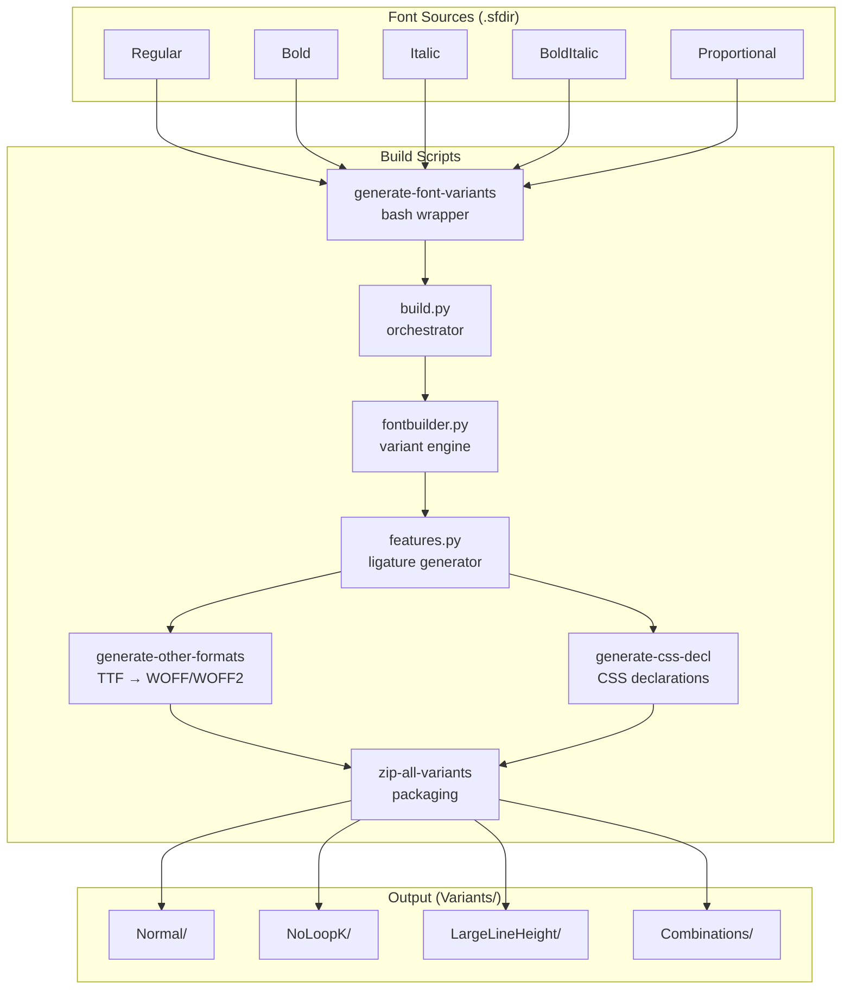
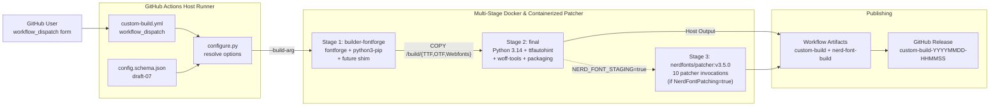
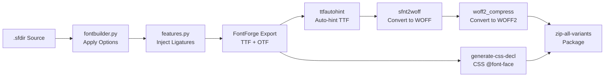

# Architecture Documentation

<!-- markdownlint-disable -->


This document serves as the canonical architectural map of the repository. It outlines the design patterns, technical stack, directory structure, and module constraints to assist developers and AI agents in navigating and maintaining the codebase safely.

## 1. Project Overview

**Fantasque Sans Mono** is a programming font (monospace) designed with functionality in mind, featuring a distinctive wibbly-wobbly handwriting-like fuzziness that makes it unassumingly cool. It was previously known as *Cosmic Sans Neue Mono*.

- **Primary Goal:** Provide a high-quality, handcrafted monospace font optimized for programming environments
- **Intended Audience:** Software developers, terminal users, and anyone seeking a unique yet readable coding font
- **Author:** Jany Belluz
- **License:** SIL Open Font License (OFL) — subsetting, compression, and modification are explicitly permitted without renaming
- **Upstream:** [belluzj/fantasque-sans](https://github.com/belluzj/fantasque-sans)

### Key Features

- **4 weights:** Regular, Bold, Italic, Bold Italic — all with identical metrics
- **Coding ligatures:** Contextual alternates (`calt`) for common programming sequences (e.g., `->`, `=>`, `!=`, `==`, `//`, `/**`, `||`)
- **Stylistic set `ss01`:** No-loop `k` variant for a cleaner look
- **Large line height variant:** Accommodates accented capital letters
- **Glyph coverage:** Latin (extensive), Cyrillic, Greek, box drawing, Powerline symbols, block characters
- **Output formats:** TTF, OTF, WOFF, WOFF2, SVG, with auto-generated CSS `@font-face` declarations

### V1 — Custom Build via GitHub Workflow (2026-07-30)

The repository now includes a **cloud-hosted Custom Build system** that allows users to generate personalized font variants directly from GitHub Actions — no local toolchain required. A configuration layer (`configure.py` + `config.schema.json`) resolves variant options from a `workflow_dispatch` form, a multi-stage Docker container builds the fonts on `ubuntu:26.04`, and the output is published as a GitHub Release. See [`docs/CUSTOM-BUILD.md`](CUSTOM-BUILD.md) for the user guide and [`spec/spec-custom-build-workflow.md`](../spec/spec-custom-build-workflow.md) for the technical specification.

## 2. High-Level Architecture & Tech Stack

| Layer | Technology |
|---|---|
| **Primary Language (Build)** | Python 3 + Bash (shell scripting); legacy engine scripts unported — run via the `future` compatibility shim |
| **Font Authoring** | FontForge (`.sfdir` — Spline Font Directory format) |
| **Build Orchestration** | GNU Make (local), GitHub Actions `workflow_dispatch` (cloud) |
| **Cloud Config Layer** | Python 3.14 (`Scripts/configure.py`) on GitHub Actions host runner |
| **Font Hinting** | `ttfautohint` (Freetype auto-hinter) |
| **Web Font Conversion** | `sfnt2woff` (WOFF), `woff2_compress` (WOFF2 from Google) |
| **Containerization** | Docker multi-stage: Stage 1 (ubuntu:26.04 + FontForge + `future` shim), Stage 2 (ubuntu:26.04 + deadsnakes Python 3.14), Stage 3 (nerdfonts/patcher:v3.5.0 containerized patcher invocations) |
| **CI/CD** | GitHub Actions (`.github/workflows/custom-build.yml`) |
| **OS Packaging** | `fpm` (DEB/RPM) |
| **Architectural Pattern** | Pipeline-based Build → Permutation Engine → Multi-format Output; cloud path: Configuration Layer → Container Build → Release Publishing |

### Architecture Diagram



### Custom Build Workflow Architecture (V1)



## 3. Data Flow & Layer Dependencies

### Local Build Pipeline

The build pipeline follows a strict linear flow with a variant explosion step:

1. **Source Layer** — FontForge `.sfdir` directories containing per-glyph spline data
2. **Variant Expansion Layer** — `fontbuilder.py` reads the font and applies option permutations (binary bitmap)
3. **Feature Generation Layer** — `features.py` scans for `.liga` glyphs and auto-generates OpenType `calt` substitution rules
4. **Format Conversion Layer** — FontForge exports TTF/OTF, then shell scripts convert to WOFF/WOFF2/SVG
5. **Packaging Layer** — CSS declarations generated, all files zipped per variant



### Custom Build Cloud Pipeline (V1)

1. **Configuration Layer** — `configure.py` (Python 3.14, host runner) validates `config.json` against `config.schema.json`, resolves precedence (`workflow_dispatch` > `config.json` > defaults), and emits build args + manifest
2. **Stage 1 (Font Compilation)** — `ubuntu:26.04` Docker, default `fontforge` with embedded Python 3 bindings + `future` shim; `custom_build_driver.py` compiles fonts under Python 3 via `past.builtins`
3. **Stage 2 (Packaging)** — `ubuntu:26.04` + deadsnakes Python 3.14, `ttfautohint`, `sfnt2woff`, `woff2_compress`, `zip`/`tar` assembly; `packaging.sh` produces `.zip` + `.tar.gz` bundles
4. **Stage 3 (Nerd Font Patching - Optional)** — When `NerdFontPatching` is enabled, host runner pulls pinned `nerdfonts/patcher:v3.5.0` Docker image (with `set +e` failure isolation), runs 10 patcher invocations over staged TTF/OTF fonts in `nf-staging/`, packages `fantasque-sans-nerd-font.zip`/`.tar.gz`, and stamps `nerd_font_version: "3.5.0"` into `manifest.json`
5. **Release Publishing** — `gh release create` with exponential backoff retry (GUD-003), GitHub Release tagged `custom-build-YYYYMMDD-HHMMSS-{run_id}-{run_attempt}` attaching base archives and optional NF archives

### Variant Permutation Logic

The build system generates all possible variants using a binary bitmap approach:

```python
# Each option acts as an independent binary toggle:
# Bit 0: LargeLineHeight (on/off)
# Bit 1: NoLoopK (on/off)

# Operations are applied in sequence:
# 1. Line(ascent, descent)      → Adjust line height metrics
# 2. SwapLookup('ss01')          → Swap looped k with straight k
# 3. Variation(name)             → Rename font family
```

## 4. Dependencies & External Services

| Dependency | Purpose | Required |
|---|---|---|
| **FontForge** (≥ 2017) | Font creation, editing, and TTF/OTF export via Python API | Yes — core build |
| **ttfautohint** | Automatic TrueType hinting for Windows rendering quality | Yes |
| **sfnt2woff** (woff-tools) | Convert TTF to WOFF format for web use | Yes |
| **woff2_compress** (Google WOFF2) | Convert TTF to WOFF2 format (superior web compression) | Yes |
| **Docker** (≥ 18.x) | Containerized build environment (Ubuntu 26.04 + all deps) | Optional (local); Required (cloud) |
| **fpm** (Effing Package Management) | Build `.deb` and `.rpm` OS packages | Optional |
| **Python 3 + `future` shim** | FontForge embedded Python 3 bindings run the legacy engine scripts (`past.builtins` provided by the `future` package from PyPI) | Yes — build |
| **Python 3.14** (deadsnakes PPA) | Post-build packaging tooling in Stage 2; `configure.py` on host runner | Yes — cloud build |
| **GitHub Actions** | CI/CD orchestration for `workflow_dispatch` custom builds | Required — cloud |
| **`gh` CLI** | GitHub Release creation from the Actions runner | Required — cloud |

> **Note:** As of 2026-07-30 the `Dockerfile` is a multi-stage build pinned to `ubuntu:26.04` (both stages, per ADR-0002); the legacy single-stage Ubuntu 18.04 setup was superseded during the Custom Build Workflow implementation.

> **Important:** The `ppa:fontforge/fontforge` PPA does not support Ubuntu 26.04, so the Dockerfile uses the default Ubuntu 26.04 `fontforge` package (embedded Python 3 bindings) instead. The `future` package is installed from PyPI (`pip3 install --break-system-packages future`) to provide the `past.builtins` compatibility shim.

## 5. Directory Tree Map

```text
fantasque-sans/
├── .agents/                          # AI Agent SDLC pipeline infrastructure
│   ├── instructions/                 # Global agent instructions
│   │   ├── clean-code-clean-architecture.instructions.md
│   │   ├── markdown.instructions.md
│   │   └── memory.instructions.md    # Cross-session context persistence
│   ├── rules/                        # Agent persona definitions
│   │   ├── SDLCOrchestrator.md       # Phase router / base persona
│   │   └── ...                       # Other SDLC agent rules
│   ├── skills/                       # Agent skill workflows (18 skills)
│   │   ├── sdlc-write-code/          # God Mode Dev (phase execution)
│   │   │   └── references/           # EXECUTION-WORKFLOW.md, COMMUNICATION-PROTOCOL.md
│   │   ├── sdlc-code-review/         # Code review skill
│   │   │   └── references/           # CLEAN-CODE-ARCHITECTURE.md, SECURITY-HARDENING.md
│   │   ├── sdlc-map-architecture/    # Architecture mapping skill
│   │   │   └── references/           # ARCHITECTURE-TEMPLATE.md
│   │   └── ...                       # 15 other SDLC + utility skills
│   └── standards/                    # Documentation templates
│       ├── ADR-FORMAT.md             # Architecture Decision Record template
│       └── CONTEXT-FORMAT.md         # Domain glossary template
├── .github/                          # GitHub configuration
│   └── workflows/
│       └── custom-build.yml          # V1 Custom Build CI/CD pipeline
├── docs/                             # Project documentation
│   ├── adr/                          # Architecture Decision Records
│   │   ├── 0001-multi-stage-docker-legacy-tools.md
│   │   └── 0002-multi-stage-docker-deferred-engine-port.md
│   ├── audit/                        # SDLC audit reports
│   │   ├── clarification-report-plan-custom-build-workflow-2026-07-26.md
│   │   ├── consistency-audit-custom-build-workflow-2026-07-26.md
│   │   └── phase-6-verification-report-2026-07-29.md
│   ├── ARCHITECTURE.md               # This file
│   ├── CUSTOM-BUILD.md               # Custom Build user documentation
│   ├── discovery-draft-20260723-1058-custom-build-workflow.md  # Phase 0 discovery
│   └── prd-20260723-1130-custom-build-workflow.md  # Product Requirements Document
├── plan/                             # Implementation plans
│   ├── plan-feature-custom-build-workflow-v1.3.md  # Custom Build implementation plan
│   └── plan-refactor-code-review-v1.0.md           # Code review remediation plan
├── spec/                             # Technical specifications
│   └── spec-custom-build-workflow.md # V1 Custom Build spec (v1.6)
├── Scripts/                          # Build pipeline (executable scripts)
│   ├── build.py                      # Legacy build orchestrator (CON-001)
│   ├── fontbuilder.py               # Legacy variant engine (CON-001)
│   ├── features.py                   # Legacy ligature feature generator (CON-001)
│   ├── custom_build_driver.py        # V1 Stage 1 driver (FontForge Python 3)
│   ├── configure.py                  # V1 configuration wrapper (host runner)
│   ├── packaging.sh                  # V1 Stage 2 packaging script
│   ├── generate-font-variants        # Bash wrapper for build.py
│   ├── generate-other-formats        # TTF → WOFF/WOFF2 converter
│   ├── generate-css-decl             # CSS @font-face declaration generator
│   ├── validate-font                 # Font validation checker
│   └── zip-all-variants              # Final packaging script
├── Sources/                          # Font source files (FontForge format)
│   ├── FantasqueSans.sfdir/          # Proportional variant (~300+ glyph files)
│   ├── FantasqueSansMono-Regular.sfdir/ # Monospace Regular (~600+ glyph files)
│   ├── FantasqueSansMono-Bold.sfdir/ # Monospace Bold
│   ├── FantasqueSansMono-Italic.sfdir/ # Monospace Italic
│   └── FantasqueSansMono-BoldItalic.sfdir/ # Monospace Bold Italic
├── Specimen/                         # Screenshots and specimen PDF
│   ├── Specimen.pdf, Specimen.png
│   └── kdevelop11.png, sublime11.png, urxvt13.png, vim21.png, noloopk.png
├── tests/                            # Python test suite (pytest)
│   ├── conftest.py                   # Test configuration (Scripts/ in sys.path)
│   ├── test_configure.py             # 62 unit tests for configure.py
│   └── fixtures/                     # Test fixture files
├── Variants/                         # Build output (generated, gitignored)
│   ├── Normal/, NoLoopK/, LargeLineHeight/
│   └── NoLoopK-LargeLineHeight/
├── .dockerignore                     # Docker build exclusions
├── AGENTS.md                         # Master agent rules & SDLC workflow definition
├── CHANGELOG.md                      # Release history (v1.1 → v1.8.0)
├── config.schema.json               # V1 build configuration schema (JSON Schema draft-07)
├── CONTEXT.md                        # Domain glossary (Custom Build terminology)
├── Dockerfile                        # Multi-stage Docker build (ubuntu:26.04)
├── fontdiff                          # Font comparison HTML generator
├── LICENSE.txt                       # SIL Open Font License
├── Makefile                          # Top-level build entry point
├── pkg.sh                            # OS package builder (fpm)
├── README.md                         # Project landing page & user guide
└── _config.yml                       # GitHub Pages configuration
```

## 6. Directory Purposes & Responsibilities

### Core Build Pipeline

| Directory / File | Primary Purpose | Contains | Rules / Constraints |
|---|---|---|---|
| `Sources/` | Font source of truth | 5 `.sfdir` directories, each holding per-glyph `.glyph` files (~600+ glyphs per mono variant) | Must be opened with FontForge; `.glyph` files contain spline data in FontForge's native format |
| `Scripts/` | Build pipeline (legacy + V1) | 5 Python modules + 7 bash scripts | Python scripts require FontForge's Python API (`import fontforge`); CON-001 protects 3 legacy files |
| `Scripts/build.py` | Legacy build orchestrator | Entry point for `generate-font-variants`; defines available font options | CON-001: MUST NOT be modified; receives 4 CLI args |
| `Scripts/fontbuilder.py` | Legacy variant engine | `Line`, `Bearing`, `Swap`, `SwapLookup`, `Variation`, `DropCAltAndLiga` operations + binary bitmap permutation | CON-001: MUST NOT be modified; uses legacy `xrange` (provided by `past.builtins` under Python 3) |
| `Scripts/features.py` | Legacy ligature generator | Auto-generates OpenType `calt` feature from `.liga` glyphs | CON-001: MUST NOT be modified; adapted from [FiraCode](https://github.com/tonsky/FiraCode) |
| `Specimen/` | Visual samples | Screenshots (PNG), printable specimen (PDF) | Used in README.md for visual reference |
| `Variants/` | Build output | Generated TTF, OTF, WOFF, WOFF2, SVG files per variant | Gitignored; recreated by `make`; consumed by `pkg.sh` |

### V1 Custom Build Workflow

| Directory / File | Primary Purpose | Contains | Rules / Constraints |
|---|---|---|---|
| `Scripts/configure.py` | Configuration resolution (host runner) | Validates `config.json` against schema, resolves precedence, generates build args + manifest | Python 3.14; runs on GitHub Actions host (not in container); `WORKFLOW_VERSION = "1.3"` |
| `Scripts/custom_build_driver.py` | Stage 1 font compilation driver | Parses build args, replicates `_build()` core loop, compiles single combination per `.sfdir` | Runs inside FontForge's Python 3 interpreter; MUST NOT modify `build.py`/`fontbuilder.py`/`features.py` (CON-001) |
| `Scripts/packaging.sh` | Stage 2 packaging | ttfautohint, sfnt2woff, woff2_compress, zip/tar assembly, manifest.json handling, conditional font staging for Stage 3 | Runs inside Docker Stage 2; consumes `--build-arg` forwarded flags and `NERD_FONT_STAGING` env var |
| `nf-staging/` | Stage 3 transient workspace | Temporary workspace directory used during Nerd Font patching (TTF/, OTF/, manifest.json) | Created dynamically on host runner during Stage 3; gitignored |
| `Dockerfile` | Container definition | Multi-stage: Stage 1 (`builder-fontforge`), Stage 2 (`final`) | Both stages on `ubuntu:26.04`; PPA dropped; `pip3 install future` in Stage 1 |
| `config.schema.json` | Configuration schema | JSON Schema draft-07: 5 boolean properties with defaults, `additionalProperties: true` | Root of repository; validated by `configure.py` |
| `.github/workflows/custom-build.yml` | CI/CD pipeline | `workflow_dispatch` with 5 boolean inputs, Docker build, Stage 3 NF patching, artifact upload, release creation | `contents: write` + `actions: read` permissions; GUD-003 retry with exponential backoff; GUD-004 failure isolation |
| `.dockerignore` | Docker build exclusions | `.git/`, `__pycache__/`, `*.pyc`, `.pytest_cache/`, `output/`, `nf-staging/`, `*.zip`, `*.tar.gz`, `.agents/`, `.github/` | Prevents unnecessary files from entering the Docker build context |
| `docs/CUSTOM-BUILD.md` | User documentation | 3-step illustrated guide, Nerd Fonts subsection, troubleshooting, FAQ | End-user facing; referenced by README.md "Custom Build" link |
| `CONTEXT.md` | Domain glossary | Custom Build terminology: Variant, Normal, Fork Owner, Manifest, Workflow, NerdFontPatching | Follows `.agents/standards/CONTEXT-FORMAT.md`; opinionated terms with `_Avoid_` lists |

### Documentation & SDLC Infrastructure

| Directory / File | Primary Purpose | Contains | Rules / Constraints |
|---|---|---|---|
| `docs/` | Project documentation | ADRs, audit reports, PRD, discovery draft, user guides | Created lazily per SDLC standards |
| `docs/adr/` | Architecture Decision Records | 0001 (single-stage Docker, *Superseded*), 0002 (multi-stage Docker, deferred engine port) | Follows ADR-FORMAT.md; Triple Gate validation before creation |
| `docs/audit/` | SDLC audit artifacts | Clarification reports, consistency audits, verification reports | Historical records; provide traceability across SDLC phases |
| `spec/` | Technical specifications | `spec-custom-build-workflow.md` v1.6 | Machine-readable contracts for code execution |
| `plan/` | Implementation plans | Custom Build v1.3 plan, Code Review remediation v1.0 plan | Drive `/sdlc-write-code` execution; traceable to spec requirements |
| `spec/spec-custom-build-workflow.md` | V1 technical spec | API contracts, schema definitions, runtime architecture, acceptance criteria | v1.6 (2026-07-30); §4.5 Dockerfile pseudocode synced with implementation |
| `plan/plan-feature-custom-build-workflow-v1.3.md` | V1 implementation plan | 6 phases, task breakdown, acceptance criteria matrix | v1.3 (2026-07-30); Stage 1 environment synced |
| `docs/prd-20260723-1130-custom-build-workflow.md` | Product Requirements | User stories, acceptance criteria, technical considerations, metrics | v1.3; environment references synced (2026-07-30) |

### Agent Infrastructure

| Directory / File | Primary Purpose | Contains | Rules / Constraints |
|---|---|---|---|
| `.agents/` | AI agent ecosystem | Personas, skills, instructions, standards | Read at session start; defines SDLC pipeline |
| `.agents/rules/` | Agent persona definitions | Markdown files with identity, scope, pushback rules | Each agent has strict phase boundary; cross-phase work refused |
| `.agents/skills/` | Agent capabilities | 18 `SKILL.md` files with step-by-step workflows | Skill = Procedure; may or may not trigger session lock |
| `.agents/instructions/` | Global AI rules | Clean code, markdown formatting, memory persistence | Checked at session start |
| `.agents/standards/` | Documentation templates | ADR format, CONTEXT (domain glossary) format | All documentation must follow these formats |
| `AGENTS.md` | Master rulebook | Universal AI agent rules, SDLC workflow, communication policy | Highest-priority instruction file |

### Root-Level Files

| File | Primary Purpose | Rules / Constraints |
|---|---|---|
| `Makefile` | Build entry | Discovers `Sources/*.sfdir`, triggers pipeline, targets: `all` → `Variants/Normal/FantasqueSansMono.zip` |
| `fontdiff` | Visual comparison | Generates `fontdiff.html` — side-by-side glyph comparison with red/blue overlay |
| `pkg.sh` | OS packaging | Uses `fpm` to build `.deb` or `.rpm` from `Variants/Normal/` |
| `_config.yml` | GitHub Pages | Jekyll configuration (minimal) |
| `.gitignore` | Git exclusions | `Variants/`, `*.zip`, TeX artifacts, `*.pyc`, temp FontForge files |
| `CONTEXT.md` | Domain glossary | Custom Build terminology per CONTEXT-FORMAT.md |
| `CHANGELOG.md` | Release history | v1.1 through v1.8.0 |
| `LICENSE.txt` | License | SIL Open Font License v1.1 |

## 7. Key Configuration Files

* **`config.schema.json`** — JSON Schema draft-07 defining 4 boolean build options (`LargeLineHeight`, `NoLoopK`, `NoCalt`, `UseHinted`) with defaults and `additionalProperties: true`. Validated by `Scripts/configure.py` at build time. Missing file = empty object (no failure).
* **`Makefile`** — Primary local build orchestrator. Runs on `Sources/*.sfdir` via wildcard, generates per-font variants, triggers ZIP packaging. The `install` target copies to `~/.fonts/` and runs `fc-cache -f`.
* **`Dockerfile`** — Multi-stage build (ADR-0002): Stage 1 (`ubuntu:26.04` + `fontforge` + `python3-pip` + `future` shim from PyPI), Stage 2 (`ubuntu:26.04` + deadsnakes Python 3.14 + packaging tools). Both stages share the `ubuntu:26.04` baseline.
* **`.dockerignore`** — Excludes `.git/`, Python cache, test artifacts, archives, and agent infrastructure from the Docker build context.
* **`.gitignore`** — Excludes build outputs (`Variants/`, `*.zip`), TeX artifacts, Python bytecode (`*.pyc`), and temp FontForge files.
* **`_config.yml`** — GitHub Pages Jekyll configuration (minimal — 26 bytes).
* **`AGENTS.md`** — The single most important configuration file for AI agents. Contains the complete SDLC workflow definition, language policy, testing mandate, persona hijacking protocol, and session isolation rules.

## 8. Entry Points

### Local Build
* **Full Build:** `make` at the repository root. Discovers all `Sources/*.sfdir` files and builds each through the full pipeline.
* **Per-Font Build:** `Scripts/generate-font-variants Sources/FantasqueSansMono-Regular.sfdir Variants` — builds a single font with all variant permutations.
* **Docker Build:** `docker build -t fantasque . && docker run -v "$(pwd)/Variants:/fantasque/Variants" fantasque` — containerized build.
* **Package Creation:** `./pkg.sh` — builds `.deb` or `.rpm` (requires `fpm`).
* **Font Comparison:** `./fontdiff font1.ttf font2.ttf` — side-by-side HTML overlay.

### Custom Build (Cloud)
* **GitHub Actions Dispatch:** Navigate to the **Actions** tab → **Custom Build** → **Run workflow**, select options, trigger.
* **CLI Entry:** `python Scripts/configure.py --config-file config.json --schema-file config.schema.json --output-args-file /tmp/args` — resolve options and generate build args + manifest locally.
* **Programmatic Dispatch:** `gh workflow run custom-build.yml -f large_line_height=true -f no_calt=false`

### Test Suite
* **Run All Tests:** `python -m pytest tests/ -v` — 62 tests in `test_configure.py`.
* **Specific Test Class:** `python -m pytest tests/test_configure.py::TestResolveOptions -v`

## 9. Environment & Deployment

### CI/CD
- **Platform:** GitHub Actions
- **Trigger:** `workflow_dispatch` with 4 boolean input fields (`large_line_height`, `no_loop_k`, `no_calt`, `use_hinted`)
- **Runner:** `ubuntu-latest` (GitHub-hosted)
- **Permissions:** `contents: write` + `actions: read`
- **Pipeline:** Single job → Python 3.14 setup → `configure.py` → Docker multi-stage build → artifact upload → GitHub Release
- **Retry Strategy:** Exponential backoff for release creation (GUD-003): 1s, 5s, 25s for up to 4 attempts (initial + 3 retries)

### Deployment (Releases)
- **Local:** Manual — maintainer builds locally, uploads ZIP to [GitHub Releases](https://github.com/belluzj/fantasque-sans/releases)
- **Cloud (V1):** Automated — `gh release create` via `custom-build.yml`, tagged `custom-build-YYYYMMDD-HHMMSS-{run_id}-{run_attempt}`
- **Artifacts:** `.zip` + `.tar.gz` bundles containing fonts, `manifest.json`, `LICENSE.txt`, `README.md`

### Package Distribution
- **Homebrew (macOS):** `brew install --cask font-fantasque-sans-mono`
- **Linux (DEB/RPM):** Generated via `pkg.sh` using `fpm`

## 10. Testing Strategy

### Current Test Suite (V1 Custom Build)

| Aspect | Detail |
|---|---|
| **Framework** | `pytest` 9.x (Python 3.12) |
| **Location** | `tests/test_configure.py` (460 lines) + `tests/conftest.py` + `tests/fixtures/` |
| **Coverage** | 62 tests across 12 test classes |
| **Run Command** | `python -m pytest tests/ -v` |
| **Key Fixtures** | Schema validation, config loading, option resolution, manifest generation, form bool parsing, arg parsing, CLI entry points |

**Test Classes:**

| Class | Scope | Tests |
|---|---|---|
| `TestSchemaFile` | Schema validation as draft-07 | 3 |
| `TestLoadConfig` | Config file loading (missing file → empty object) | 2 |
| `TestLoadSchema` | Schema loading | 1 |
| `TestValidateConfig` | Validation (valid, empty, invalid types, unknown keys) | 6 |
| `TestResolveOptions` | Precedence resolution (defaults, config, form, override, mixed) | 7 |
| `TestComputeConfigSource` | `config_source` logic per Spec §9.1 | 5 |
| `TestLogOptionSources` | Per-option source logging format | 4 |
| `TestBuildDriverArgString` | Driver argument string generation | 3 |
| `TestGenerateManifest` | Manifest JSON (valid, required fields, schema, license, timestamps) | 8 |
| `TestFormBoolParser` | Boolean parsing (canonical forms + garbage rejection) | 8 |
| `TestArgParser` | CLI argument parsing | 2 |
| `TestMainEntryPoint` | End-to-end main() entry (invalid config, args + manifest output, AC-003 log) | 3 |

### Legacy Validation
- **Font Validation:** `Scripts/validate-font` runs basic checks on each `.sfdir` before build
- **Visual Inspection:** `fontdiff` script enables side-by-side glyph comparison
- **Manual QA:** Specimen screenshots across editors (Vim, KDevelop, Sublime Text, urxvt)

## 11. AI Agent Boundaries

- **Language Policy:** All user-facing agent communication must use clear and proper Indonesian (Bahasa Indonesia). Technical artifacts (code comments, commit messages, variable names, documentation files) must follow English language convention.
- **SDLC Phase Lock:** Agents are strictly session-locked to a single SDLC phase. Switching roles mid-session requires a new chat session; the `memory-manager` skill must be used before switching.
- **Documentation Standards:** All documentation must follow templates in `.agents/standards/`. ADRs require Triple Gate validation before creation.
- **Code Modification Rules:** Agents must follow the Principle of Simplicity, make Surgical Changes only, and never modify unrelated code. All code changes require accompanying tests.
- **No Unsolicited Changes:** Agents must not refactor, clean up, or "fix" adjacent code not targeted by the current task.
- **Font Source Files:** The `.sfdir` directories in `Sources/` are FontForge-native format. They must not be modified by text editors — only through FontForge itself or via FontForge's Python API in the build scripts.
- **CON-001 (Critical):** `Scripts/build.py`, `Scripts/fontbuilder.py`, `Scripts/features.py`, and root `Makefile` MUST NOT be modified, renamed, or refactored under any circumstances. The V1 custom build wraps them; V2 (ADR-0002) will port them to Python 3 natively.

## 12. Known Tech Debt & Current Constraints

| # | Item | Status | Detail |
|---|------|--------|--------|
| 1 | **Python 2.7 shebang** | ⚠️ Open (deferred to V2) | `Scripts/build.py` line 1 still declares `#!/usr/bin/env python2.7`; engine scripts are unported Python 2-style code. In the container they run under FontForge's Python 3 via `future` (`past.builtins`) shim. Full Python 3 port deferred to V2 (ADR-0002). |
| 2 | **Docker base image EOL** | ✅ RESOLVED (2026-07-30) | `Dockerfile` uses `ubuntu:26.04` for both stages (multi-stage per ADR-0002); legacy Ubuntu 18.04 superseded. |
| 3 | **Hardcoded variant options** | ✅ RESOLVED (V1) | Variant toggles are now externalized via `config.schema.json` + `configure.py`; users configure options through `workflow_dispatch` form or repository `config.json`. Legacy `build.py` in-source definitions remain untouched (CON-001). |
| 4 | **Engine port to Python 3** | ⚠️ Deferred to V2 | `Scripts/fontbuilder.py` and `Scripts/features.py` remain unported. They run under Python 3 via the `future` shim in the container, but a native Python 3.14 port is deferred to V2 (ADR-0002). |
