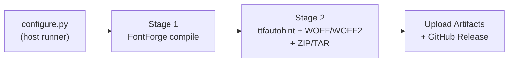
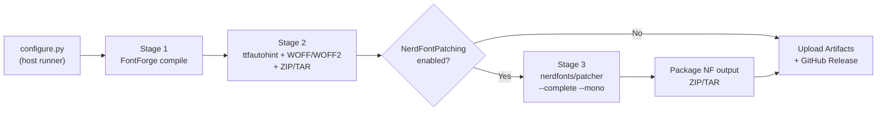
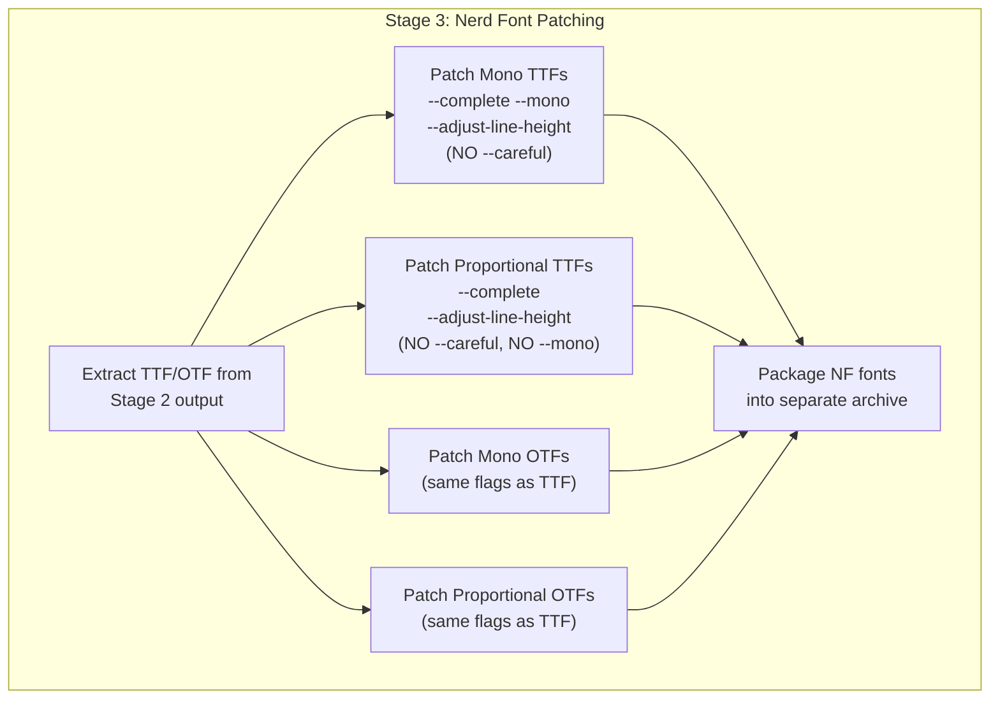

<!-- markdownlint-disable-->
# Project Discovery Summary

## 1. Project Overview

Fantasque Sans Mono is a programming font (monospace) with a distinctive handwriting-like fuzziness. The repository contains font sources (FontForge `.sfdir`), a multi-stage Docker build pipeline, and a GitHub Actions Custom Build workflow that allows users to generate personalized font variants from the cloud.

**Proposed Feature:** Integrate the [Nerd Fonts Patcher](https://github.com/ryanoasis/nerd-fonts) into the existing Custom Build pipeline as an **optional post-build patching step**. This will produce a separate "Nerd Font" variant of Fantasque Sans Mono — patched with 10,000+ developer-focused icons from Font Awesome, Material Design, Octicons, Codicons, Weather, Powerline, and more.

> **Note:** Fantasque Sans Mono is already listed in the [official Nerd Fonts patched fonts catalog](https://github.com/ryanoasis/nerd-fonts#patched-fonts) (v1.8.0, no Reserved Font Name restriction). This feature brings the patching **in-house** so every Custom Build can optionally produce a Nerd Font variant with the user's chosen build options (LargeLineHeight, NoLoopK, NoCalt, etc.) already applied.

## 2. Technology Stack & Infrastructure

*(Reference: [docs/ARCHITECTURE.md](ARCHITECTURE.md) §2 for the full tech stack.)*

### Additions Required for This Feature

| Component              | Technology                                         | Purpose                                                      |
| ---------------------- | -------------------------------------------------- | ------------------------------------------------------------ |
| **Nerd Fonts Patcher** | `nerdfonts/patcher` Docker image (v3.5.0+)         | Patches TTF/OTF files with Nerd Font glyphs                  |
| **Patcher Engine**     | FontForge Python script (`font-patcher`)           | Core patching logic; requires `fontforge` + `psMat` bindings |
| **Glyph Sources**      | `src/glyphs/` directory (bundled in Docker image)  | ~10,000+ icon glyphs from multiple icon sets                 |
| **CI Integration**     | Additional `docker run` step in `custom-build.yml` | Runs patcher after Stage 2 packaging completes               |

### Existing Components (Unchanged)

- **Stage 1 (builder-fontforge):** FontForge + `custom_build_driver.py` → TTF/OTF/SVG
- **Stage 2 (final):** `packaging.sh` → ttfautohint + WOFF/WOFF2 + ZIP/TAR
- **Configuration Layer:** `configure.py` + `config.schema.json` → build args + manifest
- **CON-001:** `build.py`, `fontbuilder.py`, `features.py`, and `Makefile` remain untouched

## 3. Current Architecture Assessment

### Strengths

- **Clean Pipeline Separation:** The multi-stage Docker build (ADR-0002) already separates font compilation (Stage 1) from packaging (Stage 2). Adding a "Stage 3" patching step is architecturally natural.
- **Externalized Configuration:** The `config.schema.json` + `configure.py` pattern supports `additionalProperties: true`, making it straightforward to add a new `NerdFontPatching` boolean option without breaking backward compatibility.
- **Existing Precedent:** The `UseHinted` toggle already demonstrates the pattern of a build option that controls a post-compilation tool (ttfautohint). The Nerd Font toggle follows the same pattern.

### Considerations & Risks

| #   | Risk                                                                                                                             | Impact                                                                        | Mitigation                                                                   |
| --- | -------------------------------------------------------------------------------------------------------------------------------- | ----------------------------------------------------------------------------- | ---------------------------------------------------------------------------- |
| 1   | **Docker image pull time** — `nerdfonts/patcher` is a large image (~500MB+) containing FontForge + all glyph sources             | Adds ~2-3 min to CI build time                                                | Pull image in parallel with earlier steps; cache Docker layers               |
| 2   | **Font file size increase** — `--complete` patching adds ~3,000+ glyphs, increasing TTF from ~300KB to ~3-4MB per weight         | Larger release archives                                                       | Expected behavior; document the size increase                                |
| 3   | **Glyph conflict resolution** — Without `--careful`, Nerd Font glyphs will replace existing glyphs at the same codepoints        | Existing Powerline and box-drawing characters in Fantasque may be overwritten | This is the **intended behavior** per user requirement                       |
| 4   | **Patcher version pinning** — `nerdfonts/patcher` updates may change behavior                                                    | Unpredictable output changes                                                  | Pin to a specific tag (e.g., `nerdfonts/patcher:v3.5.0`)                     |
| 5   | **Proportional font patching** — Patcher `--mono` flag may not produce correct results for proportional (non-monospace) variants | Visual artifacts in FantasqueSans (proportional)                              | Use `--mono` only for Mono variants; use default width mode for proportional |
| 6   | **Workflow timeout** — Patching 5 fonts × 2 formats (TTF+OTF) = 10 patcher invocations adds ~5-10 min                            | May approach the 30-min timeout                                               | Increase `timeout-minutes` if needed; consider patching only TTF             |

## 4. Operational Workflow

### Current Pipeline (Without Nerd Font Patching)



### Proposed Pipeline (With Nerd Font Patching)



### Detailed Stage 3 Flow



### Patcher Invocation Contract

For each font file, the `nerdfonts/patcher` Docker container will be invoked as:

```bash
# For Mono variants (4 weights):
docker run --rm \
    -v /path/to/input:/in \
    -v /path/to/output:/out \
    nerdfonts/patcher:v3.5.0 \
    --complete \
    --mono \
    --adjust-line-height \
    --outputdir /out \
    /in/FantasqueSansMono-Regular.ttf

# For Proportional variant (1 weight):
docker run --rm \
    -v /path/to/input:/in \
    -v /path/to/output:/out \
    nerdfonts/patcher:v3.5.0 \
    --complete \
    --adjust-line-height \
    --outputdir /out \
    /in/FantasqueSans.ttf
```

### Patcher Flags Summary

| Flag                   | Purpose                                           | Included?                     |
| ---------------------- | ------------------------------------------------- | ----------------------------- |
| `--complete`           | Include all 10,000+ icon glyphs from every set    | ✅ Yes                         |
| `--mono` / `--single`  | Force single-width glyphs for monospace alignment | ✅ Yes (Mono only)             |
| `--adjust-line-height` | Adjust line height to prevent icon clipping       | ✅ Yes                         |
| `--careful`            | Prevent overwriting existing glyphs               | ❌ No (user wants replacement) |
| `--outputdir`          | Specify output directory                          | ✅ Yes                         |

### Font Naming Convention

The patcher will use its default naming behavior (no `--makegroups -1`):

| Original Font Name             | Patched Font Name (Patcher Default)      |
| ------------------------------ | ---------------------------------------- |
| `FantasqueSansMono-Regular`    | `FantasqueSansMono Nerd Font-Regular`    |
| `FantasqueSansMono-Bold`       | `FantasqueSansMono Nerd Font-Bold`       |
| `FantasqueSansMono-Italic`     | `FantasqueSansMono Nerd Font-Italic`     |
| `FantasqueSansMono-BoldItalic` | `FantasqueSansMono Nerd Font-BoldItalic` |
| `FantasqueSans` (Proportional) | `FantasqueSans Nerd Font`                |

> **Note:** Fantasque Sans Mono does NOT have a Reserved Font Name (RFN) restriction in its SIL OFL license, so no name substitution is needed (unlike "Source Code Pro" → "SauceCodePro").

## 5. Configuration Schema Changes

### `config.schema.json` Addition

```json
{
  "NerdFontPatching": {
    "type": "boolean",
    "description": "Patches generated fonts with Nerd Font glyphs (10,000+ icons).",
    "default": false
  }
}
```

### `workflow_dispatch` Input Addition

```yaml
nerd_font_patching:
  description: "Patch fonts with Nerd Font glyphs (10,000+ icons)"
  type: boolean
  required: false
  default: false
```

### configure.py Changes

- Add `NerdFontPatching` to `DEFAULTS` dictionary
- Add `nerd_font_patching` → `NerdFontPatching` mapping to `FORM_KEY_TO_OPTION`
- `NerdFontPatching` does NOT map to a Stage 1 driver flag (similar to `UseHinted`)
- The resolved value is written into `manifest.json` for downstream consumption

### Manifest Schema Extension

```json
{
  "resolved_options": {
    "LargeLineHeight": false,
    "NoLoopK": false,
    "NoCalt": false,
    "UseHinted": true,
    "NerdFontPatching": false
  },
  "nerd_font_version": "3.5.0"
}
```

## 6. Output Structure

### When `NerdFontPatching = false` (Default)

No change from current behavior:

```text
output/
├── fantasque-sans-custom-build.zip
├── fantasque-sans-custom-build.tar.gz
├── manifest.json
├── LICENSE.txt
└── README.md
```

### When `NerdFontPatching = true`

Additional Nerd Font archive alongside the base build:

```text
output/
├── fantasque-sans-custom-build.zip          # Base fonts (unchanged)
├── fantasque-sans-custom-build.tar.gz       # Base fonts (unchanged)
├── fantasque-sans-nerd-font.zip             # Nerd Font patched variants
├── fantasque-sans-nerd-font.tar.gz          # Nerd Font patched variants
├── manifest.json                            # Updated with NF metadata
├── LICENSE.txt
└── README.md
```

### Nerd Font Archive Internal Structure

```text
fantasque-sans-nerd-font.zip
├── TTF/
│   ├── FantasqueSansMonoNerdFont-Regular.ttf
│   ├── FantasqueSansMonoNerdFont-Bold.ttf
│   ├── FantasqueSansMonoNerdFont-Italic.ttf
│   ├── FantasqueSansMonoNerdFont-BoldItalic.ttf
│   └── FantasqueSansNerdFont.ttf
├── OTF/
│   ├── FantasqueSansMonoNerdFont-Regular.otf
│   ├── FantasqueSansMonoNerdFont-Bold.otf
│   ├── FantasqueSansMonoNerdFont-Italic.otf
│   ├── FantasqueSansMonoNerdFont-BoldItalic.otf
│   └── FantasqueSansNerdFont.otf
├── manifest.json
├── LICENSE.txt
└── README.md
```

## 7. GitHub Actions Workflow Changes

### New Steps (After Step 7 "Run Stage 2 packaging")

```yaml
# 7.5. Pull Nerd Fonts Patcher image (conditional)
- name: Pull Nerd Fonts Patcher
  if: inputs.nerd_font_patching == true
  run: docker pull nerdfonts/patcher:v3.5.0

# 7.6. Run Nerd Font Patching (conditional)
- name: Patch fonts with Nerd Fonts
  if: inputs.nerd_font_patching == true
  run: |
    mkdir -p nf-output/TTF nf-output/OTF
    # Patch Mono TTFs
    for ttf in output/TTF/FantasqueSansMono-*.ttf; do
      docker run --rm \
        -v "$(pwd)/output/TTF:/in" \
        -v "$(pwd)/nf-output/TTF:/out" \
        nerdfonts/patcher:v3.5.0 \
        --complete --mono --adjust-line-height \
        --outputdir /out \
        "/in/$(basename $ttf)"
    done
    # Patch Proportional TTF (if exists)
    if [ -f "output/TTF/FantasqueSans.ttf" ]; then
      docker run --rm \
        -v "$(pwd)/output/TTF:/in" \
        -v "$(pwd)/nf-output/TTF:/out" \
        nerdfonts/patcher:v3.5.0 \
        --complete --adjust-line-height \
        --outputdir /out \
        "/in/FantasqueSans.ttf"
    fi
    # Repeat for OTF...

# 7.7. Package Nerd Font output (conditional)
- name: Package Nerd Font variants
  if: inputs.nerd_font_patching == true
  run: |
    cd nf-output
    cp ../output/manifest.json .
    cp ../LICENSE.txt .
    cp ../README.md .
    zip -r ../output/fantasque-sans-nerd-font.zip TTF OTF manifest.json LICENSE.txt README.md
    tar czf ../output/fantasque-sans-nerd-font.tar.gz TTF OTF manifest.json LICENSE.txt README.md
```

### Modified Steps

- **Step 8 (Upload artifacts):** Add `output/fantasque-sans-nerd-font.*` to the upload path (conditional)
- **Step 11 (Create Release):** Add the NF archives as additional release assets (conditional)
- **Step 9 (Job summary):** Add Nerd Font patching status to the summary

## 8. Handoff Notes for Product Manager (/sdlc-draft-prd)

### Critical Context for PRD Author

1. **CON-001 Invariant:** `build.py`, `fontbuilder.py`, `features.py`, and `Makefile` MUST NOT be modified. The Nerd Font feature is entirely additive — it operates on the **output** of the existing pipeline, not on the pipeline internals.

2. **Backward Compatibility:** When `NerdFontPatching = false` (the default), the entire pipeline behaves identically to the current V1 workflow. Zero regression risk for existing users.

3. **License Compliance:** Fantasque Sans Mono uses SIL OFL without Reserved Font Names. The Nerd Fonts Patcher will NOT need to rename the font family (no RFN substitution required), but will follow its standard naming convention of appending "Nerd Font" to the family name.

4. **External Dependency:** This feature introduces a new external Docker image dependency (`nerdfonts/patcher`). The PRD should address:
   - Version pinning strategy (pin to tag, not `latest`)
   - Fallback behavior if the Docker image is unavailable (fail the NF step, but still produce base fonts)
   - Image size impact on CI build times (~2-3 min additional for image pull)

5. **Testing Strategy:**
   - Unit tests for `configure.py` additions (new option resolution)
   - Integration test: verify patcher produces valid font files with expected glyph count
   - Visual verification: spot-check Nerd Font icons render correctly at common terminal sizes

6. **File Impact Summary:**
   - `config.schema.json` — Add `NerdFontPatching` property
   - `Scripts/configure.py` — Add option to DEFAULTS, FORM_KEY_TO_OPTION
   - `.github/workflows/custom-build.yml` — Add workflow input + 3 new steps
   - `docs/CUSTOM-BUILD.md` — Document the new option
   - `tests/test_configure.py` — Add test cases for new option

7. **Proportional Font Caveat:** Patching the proportional `FantasqueSans` variant with Nerd Font glyphs is less common (most users want Nerd Fonts in their terminal, which uses monospace). The PRD should consider whether this adds value or is unnecessary complexity.

8. **Stage 2 Font Extraction:** The current `packaging.sh` outputs fonts into `/app/output/` as part of the ZIP archive. The NF patching step needs access to the **pre-packaged** TTF/OTF files. The workflow must either:
   - Extract fonts from the Stage 2 output directory (before they are zipped), OR
   - Run the patcher against the fonts in the `output/` directory that are also available from the Stage 2 Docker volume mount
